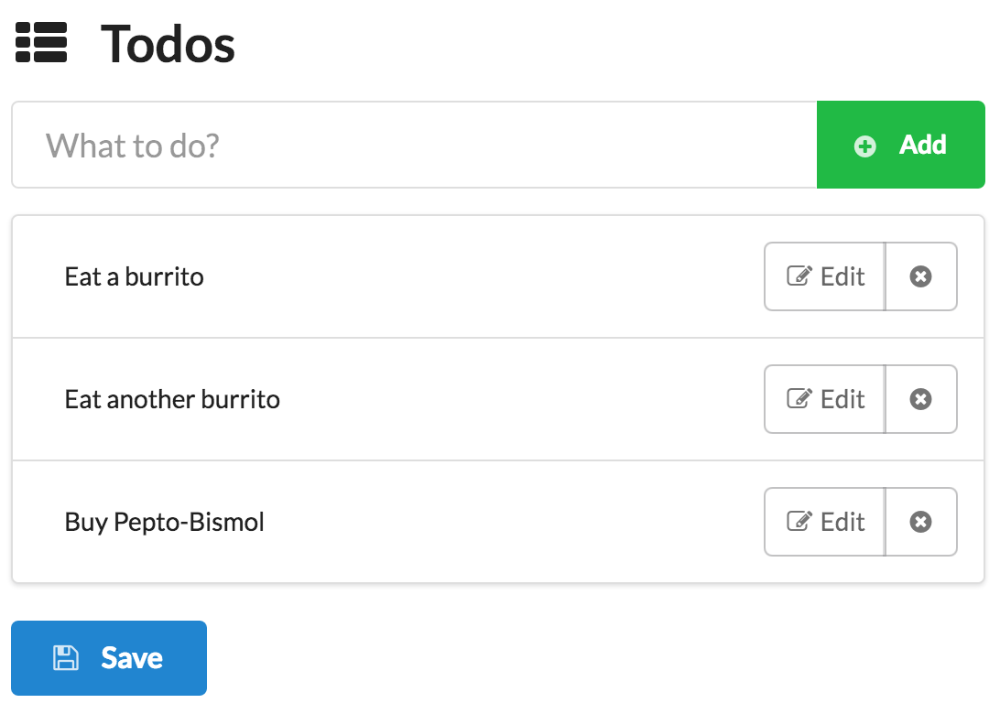

# Yolk/RxJS/Express/Postgres Todo App

> A Todo application built on top [Yolk.js](https://github.com/garbles/yolk), [RxJS](https://github.com/Reactive-Extensions/RxJS), [Express](http://expressjs.com/), and [Postgres](http://www.postgresql.org/), which runs in [Docker](https://www.docker.com/) container.



# Demo

[http://lab.moogs.io/rx-todo](http://lab.moogs.io/rx-todo)

# Running

To see it in action follow these steps:

1. Install Docker from [Downloads](https://docs.docker.com/engine/installation/) page.

2. Git clone this repo.

  ```bash
  $ git clone git@github.com:miguelmota/rx-todo.git
  ```

3. Set up Docker and build.

  ```bash
# Start docker daemon
  $ eval "$(docker-machine env default)"

# Build
  $ docker-compose build
  ```

4. Run Docker container.

  ```bash
  $ docker-compose up
  ```

5. Open app url in browser.

  ```bash
  $ open http://$(docker-machine ip):8080/
  ```

6. Write todos.

# Development

Follow these steps to set up development environment.

1. Install Postgres from the [Downloads](http://www.postgresql.org/download/) page.

2. Configure postgres credentials in `app/config/config.json`.

3. Install node dependencies.

  ```bash
  $ npm install
  $ npm install babel-cli -g
  $ npm install gulp-cli -g
  ```

4. Run Express server.

  ```bash
  $ npm start
  ```

5. Run [Gulp](http://gulpjs.com/) watchers to compile front-end JavaScript and Sass on save.

  ```bash
  $ cd app/public/

  $ gulp watch
  ```

  Available Gulp tasks.

  ```bash
  # Compile JavaScript.
  $ gulp scripts

  # Compile Sass.
  $ gulp sass

  # Compile JavaScript and Sass.
  $ gulp build

  # Compile JavaScript and Sass on file save.
  $ gulp watch

  # Open client only url in browser.
  $ gulp browser
  ```

6. Open app url in browser.

  ```bash
  open http://localhost:8080/
  ```

# Test

  ```bash
  $ npm test
  ```

# License

MIt.
